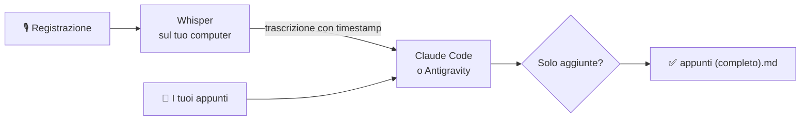

<p align="center">
  <picture>
    <source media="(prefers-color-scheme: dark)" srcset="docs/banner-dark.svg">
    
  </picture>
</p>

<p align="center">
  <b>Completa i tuoi appunti con la registrazione della lezione.</b><br>
  Trascrizione locale con Whisper · un merge con Claude Code o Antigravity · lacune colmate, errori segnalati, il tuo testo intatto e verificato.
</p>

<p align="center">
  <a href="#installazione"></a>
  <a href="#installazione"></a>
  <a href="https://github.com/ggml-org/whisper.cpp"></a>
  <a href="https://claude.com/claude-code"></a>
  <a href="https://antigravity.google/docs/cli"></a>
</p>

<p align="center"><a href="README.md">English</a> · <b>Italiano</b></p>

---

Registri ogni lezione, ma nessuno riascolta 90 minuti di audio per sistemare gli appunti.
**Lo fa rec2notes al posto tuo.** Trascrive la registrazione sul tuo computer, poi fa sì che un agente AI, Claude Code o Antigravity di Google,
colmi le lacune dei tuoi appunti, segnali quello che hai scritto male ed elenchi quello che ti sei perso,
senza cambiare niente di quello che hai scritto: rec2notes controlla che ogni parola, simbolo e a capo dei tuoi appunti ci sia ancora.

- ✍️ **Lacune colmate**, nello stile dei tuoi appunti: la definizione che non hai preso, il passaggio che hai saltato, i tuoi `[?]`.
- ⚖️ **Errori segnalati, non corretti**: la tua frase resta, con una nota a piè di pagina che dice cosa è stato detto e quando, così decidi tu.
- 🧭 **Argomenti persi** raccolti in fondo, ognuno con il suo timestamp e il punto in cui va.
- 🔒 **I tuoi appunti non vengono mai toccati**: il risultato è un nuovo file accanto, `<appunti> (completo).md`.
- 📝 **Hai saltato la lezione?** rec2notes scrive degli appunti di studio dalla sola registrazione.



## Installazione

Ti servono un PC con Windows 11 o Linux e lo strumento da riga di comando di un agente AI, **Claude Code** o **Antigravity**. La GPU è facoltativa, ma rende la trascrizione molto più veloce.

### Un agente AI

Scegline uno e installalo prima di rec2notes; con entrambi installati, `rec2notes setup` chiede quale usare.

#### Claude Code

Richiede un abbonamento Claude (Pro o superiore).

```powershell
# Windows: installa Claude Code, poi accedi con il tuo account Claude
irm https://claude.ai/install.ps1 | iex
claude auth login
```

```sh
# Linux: installa Claude Code, poi accedi con il tuo account Claude
curl -fsSL https://claude.ai/install.sh | bash
claude auth login
```

#### Antigravity

L'agente di Google; richiede un account Google. Gli studenti possono averlo gratis con un piano Google, quindi controlla l'offerta della tua università.

```powershell
# Windows: installa lo strumento da riga di comando di Antigravity, `agy`
irm https://antigravity.google/cli/install.ps1 | iex
```

```sh
# Linux: installa lo strumento da riga di comando di Antigravity, `agy`
curl -fsSL https://antigravity.google/cli/install.sh | bash
```

Poi apri un nuovo terminale, avvia `agy` una volta, accedi con il tuo account Google ed esci con Ctrl+C. La sua prima esecuzione in rec2notes dice cosa va a Google e chiede prima di inviare qualsiasi cosa: leggi [Privacy e sicurezza](#privacy-e-sicurezza).

Per cambiare agente in seguito: `rec2notes` → **4 Impostazioni** → **a**; una singola esecuzione può sceglierlo con `--agent claude` o `--agent antigravity`.

### Windows 11

Nel Terminale (PowerShell):

```powershell
# Installa Python e FFmpeg, che converte le registrazioni
winget install Python.Python.3.13 Gyan.FFmpeg
# Installa pipx, che installa i programmi Python ognuno nel suo ambiente
py -m pip install --user pipx
# Aggiungi la cartella dei programmi di pipx al PATH, così rec2notes si avvia per nome
py -m pipx ensurepath
```

Chiudi e riapri il Terminale, poi:

```powershell
# Installa rec2notes da questo repository
pipx install https://github.com/alevuolo17/uni-rec2notes/archive/refs/heads/main.zip
# Scarica Whisper e il suo modello vocale nella cartella di rec2notes
rec2notes setup
```

`setup` chiede in che lingua parla rec2notes, **English** o **Italiano**, poi dove tenere la sua cartella (di default `C:\Users\<tuo-utente>\rec2notes`), poi **cpu** o **vulkan**: scegli vulkan se hai una scheda video AMD, NVIDIA o Intel. Scarica una build di Whisper già pronta e il modello vocale; non si compila niente.

### Linux

<details>
<summary>Prima installa i pacchetti: Fedora, Debian/Ubuntu, Arch</summary>

```sh
# Fedora: pipx, gli strumenti di build, FFmpeg (da RPM Fusion, o ffmpeg-free) e gli strumenti Vulkan
sudo dnf install -y pipx cmake gcc-c++ make git ffmpeg vulkan-headers vulkan-loader-devel glslc spirv-tools spirv-headers-devel
# Debian / Ubuntu 24.04+: gli stessi pacchetti con i loro nomi
sudo apt install -y pipx build-essential cmake git ffmpeg libvulkan-dev glslc spirv-headers spirv-tools
# Arch: gli stessi pacchetti con i loro nomi
sudo pacman -S --needed python-pipx base-devel cmake git ffmpeg vulkan-headers vulkan-icd-loader shaderc spirv-headers spirv-tools
```

I pacchetti Vulkan servono solo per trascrivere sulla GPU; senza, la trascrizione gira sulla CPU.
</details>

```sh
# Installa rec2notes da questo repository
pipx install https://github.com/alevuolo17/uni-rec2notes/archive/refs/heads/main.zip
# Aggiungi la cartella dei programmi di pipx al PATH (una volta), poi apri un nuovo terminale
pipx ensurepath
# Compila Whisper in ~/rec2notes e scarica il suo modello vocale
rec2notes setup
```

`setup` chiede prima in che lingua parla rec2notes, **English** o **Italiano**, poi dove tenere la sua cartella e quale backend e modello usare. **4 Impostazioni** → **l** cambia la lingua in seguito.

### Verifica

```sh
# Controlla tutto ciò che serve a rec2notes e stampa come sistemare quello che manca
rec2notes doctor
```

## Uso

Scrivi `rec2notes` in un terminale. Si apre un menu, nella lingua che hai scelto in `setup`; scrivi un numero o una lettera e premi Invio:

```menu
  1  Esegui: completa degli appunti, o creane di nuovi, da una registrazione
  2  Doctor: controlla che sia tutto configurato
  3  Corsi: elencali, aggiungi i tuoi
  4  Impostazioni: la tua cartella rec2notes, agente, modello, effort e Whisper
  q  Esci
```

Quando ti chiede un file, puoi scriverne il percorso, incollarlo o trascinare il file nel terminale.

**4 Impostazioni** salva i valori di default da cui parte ogni esecuzione: l'agente (Claude Code o Antigravity), il suo modello, l'effort, il modello Whisper, tra quelli che hai scaricato, e la lingua delle schermate di rec2notes (**l**: English o Italiano; gli appunti scritti dall'agente non cambiano). I modelli di Claude sono quello di default di Claude Code, opus, sonnet o haiku, e il suo effort va da low a max (più alto è più lento e accurato). Quelli di Antigravity sono quelli del tuo account, come li elenca `agy models`; il loro nome contiene l'effort (`-high`, `-low`), quindi non c'è la riga Effort. Prima di avviare un'esecuzione, **c** cambia uno di questi solo per quell'esecuzione.

### La prima volta: aggiungi il tuo corso

**3 → a.** Dai al corso un nome breve (`reti`), il nome completo (`Reti di calcolatori`) e un vocabolario: una frase con 15–30 termini chiave, soprattutto termini inglesi e sigle, così Whisper li scrive giusti nel parlato italiano:

```text
Lezione di reti. Termini tecnici in inglese: TCP, UDP, handshake, routing, subnet, NAT, DNS, socket, …
```

Infine, la cartella che contiene gli appunti del corso. Quando gli appunti sono lì, o in una sua sottocartella, l'esecuzione sceglie il corso per te: Invio conferma. Con **e** modifichi un corso in seguito.

### Completare gli appunti

**1 → 1**, poi:

1. **Appunti (.md)**: gli appunti che hai preso a lezione.
2. **Pulire prima gli appunti?** Invio per no. Rispondi `s` se sono ancora grezzi: rec2notes li riordina in `<appunti> (pulito).md` e completa quella copia.
3. **Registrazione**: l'audio della lezione. Se è stato registrato in più parti, dai la parte successiva quando te la chiede, in ordine; Invio quando non ce ne sono altre.
4. **Di quale corso si tratta?** Se gli appunti sono nella cartella di uno dei tuoi corsi, quel corso è già segnato e Invio lo sceglie.
5. **Un riepilogo**: corso, appunti, registrazione, e l'agente con il suo modello ed effort, e il modello Whisper. Invio avvia; `c` cambia modelli ed effort per questa esecuzione. Tutto ciò che fermerebbe l'esecuzione, come un modello Whisper non scaricato, è elencato qui, prima che parta.

Ottieni `<appunti> (completo).md` accanto ai tuoi appunti. Cerca le note `[^conflitto-N]`, dove i tuoi appunti e la lezione non coincidono, e la sezione *Argomenti non presenti negli appunti* in fondo. Se qualcosa che hai scritto è andato perso o è cambiato, il terminale lo elenca; un segnaposto completato dall'agente, come "da completare", è normale che compaia lì. Quello che l'agente ha aggiunto non è segnato, quindi rileggi gli appunti prima di fidarti.

### Creare appunti da una registrazione

Per una lezione di cui non hai appunti: **1 → 2**. Dai il percorso completo dei nuovi appunti (la cartella deve esistere), la registrazione e il corso. Gli appunti escono lunghi circa un quinto della trascrizione, organizzati per argomento. L'audio poco chiaro è segnato con `[? hh:mm:ss]` e ciò che si vedeva solo su una slide con `(integra con slide)`.

<details>
<summary>Tutti i comandi</summary>

Tutto ciò che fa il menu è anche un comando, per gli script o se preferisci scrivere:

| Comando | Cosa fa |
|---|---|
| `rec2notes` | Il menu. |
| `rec2notes NOTE AUDIO...` | Completa degli appunti. `--clean` prima li pulisce; `--force` sostituisce un file `(completo)` già esistente; `--dry-run` mostra cosa verrebbe inviato. |
| `rec2notes create NOTE AUDIO...` | Scrive nuovi appunti dalla registrazione. `--length PCT`: quanto lunghi, come percentuale della trascrizione (default 20). |
| `rec2notes clean NOTE` | Riordina soltanto degli appunti grezzi in `<appunti> (pulito).md`. |
| `rec2notes course add\|edit\|list` | Gestisce i tuoi corsi e le loro cartelle di appunti. |
| `rec2notes doctor` | Controlla l'installazione; la prima riga è la tua versione (anche `rec2notes --version`). |
| `rec2notes setup` | Installa o cambia Whisper (backend, modello) e sceglie la lingua (`--language en` o `it`, che salta la domanda). Si può rilanciare: tiene il tuo backend a meno che tu non ne scelga un altro. |
| `rec2notes uninstall` | Cancella la cartella di rec2notes; poi `pipx uninstall uni-rec2notes`. |

Ogni esecuzione accetta anche `--course`, `--whisper-model`, `--agent`, `--model` e `--effort`; `rec2notes -h` li elenca. Un'opzione vince su `$REC2NOTES_WHISPER_MODEL`, `$REC2NOTES_AGENT`, `$REC2NOTES_MODEL` e `$REC2NOTES_EFFORT`, che vincono sui valori di default salvati in Impostazioni. `--effort` è di Claude: i nomi dei modelli di Antigravity contengono il loro.
</details>

## Privacy e sicurezza

- **La trascrizione resta sul tuo computer**: la registrazione non lo lascia mai.
- **Cosa tiene rec2notes.** Ogni esecuzione tiene una copia degli appunti, della trascrizione e della risposta dell'agente in `cache/runs` nella cartella di rec2notes (e il tuo vecchio file `(completo)`, quando `--force` l'ha sostituito), per 30 giorni: la prima esecuzione dopo li cancella. Le trascrizioni restano in `cache/transcripts`, così rieseguire non trascrive di nuovo, fino a `rec2notes uninstall`.
- **Gli appunti vanno al tuo agente.** Un merge, `clean` o `create` invia gli appunti, la trascrizione e il nome e il vocabolario del corso ad Anthropic (Claude Code) o a Google (Antigravity), alle condizioni del tuo account. Con gli account Google personali, le condizioni di Antigravity permettono a Google di usare ciò che invii per migliorare i suoi modelli; rec2notes disattiva la telemetria di Antigravity, ma Google non ha detto che basti. La prima esecuzione con Antigravity chiede prima di inviare qualsiasi cosa.
- **Chiedi prima di registrare.** Alcuni professori non permettono di registrare la lezione, o di condividerne la registrazione o la trascrizione.
- **L'agente non ha strumenti**: niente file, niente comandi, niente web. Claude Code gira con `--tools ""`. Antigravity gira in una cartella usa e getta con impostazioni che negano ogni strumento, cancellata dopo ogni chiamata, ma la sua ricerca web non si può disattivare: quando l'agente l'ha usata, l'esecuzione ti avvisa. Controlla quegli appunti: ciò che ha cercato non viene dalla lezione, e una trascrizione potrebbe contenere istruzioni rivolte all'agente.

## Aggiornare e disinstallare

Per sapere quando esce una nuova versione, usa **Watch → Custom → Releases** su questo repository.

```sh
# Mostra la versione che hai
rec2notes --version
# Aggiorna all'ultima versione, dallo stesso indirizzo da cui hai installato
pipx upgrade uni-rec2notes
# Disinstalla: cancella la cartella di rec2notes, dopo averlo chiesto; i tuoi appunti non vengono mai toccati
rec2notes uninstall
# Poi rimuovi il comando rec2notes stesso
pipx uninstall uni-rec2notes
```
