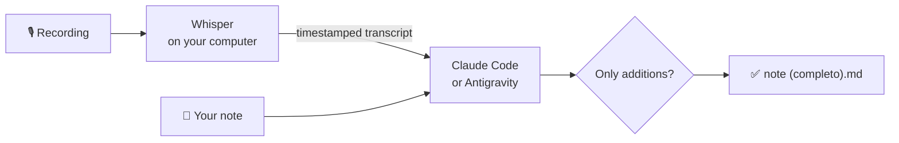

<p align="center">
  <picture>
    <source media="(prefers-color-scheme: dark)" srcset="docs/banner-dark.svg">
    
  </picture>
</p>

<p align="center">
  <b>Complete your lecture notes from the lecture recording.</b><br>
  Local Whisper transcription · a Claude Code or Antigravity merge · gaps filled, conflicts flagged, your words never rewritten.
</p>

<p align="center">
  <a href="#install"></a>
  <a href="#install"></a>
  <a href="https://github.com/ggml-org/whisper.cpp"></a>
  <a href="https://claude.com/claude-code"></a>
  <a href="https://antigravity.google/docs/cli"></a>
</p>

<p align="center"><b>English</b> · <a href="README.it.md">Italiano</a></p>

---

You record every lecture, but nobody listens to 90 minutes of audio again to fix their notes.
**rec2notes does it for you.** It transcribes the recording on your own computer, then has an AI agent, Claude Code or Google's Antigravity,
fill the gaps in your notes, flag what you wrote down wrong, and list what you missed, without
rewriting a single word of yours.

- ✍️ **Gaps filled**, in your note's own style: the definition you didn't catch, the step you skipped, your `[?]`.
- ⚖️ **Mistakes flagged, not fixed**: your sentence stays, with a footnote saying what was said and when, so you decide.
- 🧭 **Missed topics** collected at the end, each with its timestamp and where it fits.
- 🔒 **Your note is never touched**: the result is a new file next to it, `<note> (completo).md`.
- 📝 **Missed the lecture?** rec2notes writes a study note from the recording alone.



## Install

You need a Windows 11 or Linux PC and the command-line tool of an AI agent, **Claude Code** or **Antigravity**. A GPU is optional but makes transcription several times faster.

### An AI agent

Pick one and install it before rec2notes; with both installed, `rec2notes setup` asks which to use.

- **Claude Code** needs a Claude subscription (Pro or higher).
- **Antigravity**, Google's agent, needs a Google account; students may get it free with a Google plan, so check your university's offer.

```powershell
# Windows: install Claude Code, then log in with your Claude account
irm https://claude.ai/install.ps1 | iex
claude auth login
```

```sh
# Linux: install Claude Code, then log in with your Claude account
curl -fsSL https://claude.ai/install.sh | bash
claude auth login
```

```powershell
# Windows: install Antigravity's command-line tool, `agy`
irm https://antigravity.google/cli/install.ps1 | iex
```

```sh
# Linux: install Antigravity's command-line tool, `agy`
curl -fsSL https://antigravity.google/cli/install.sh | bash
```

For Antigravity, open a new terminal, run `agy` once, sign in with your Google account and quit with Ctrl+C. Its first run in rec2notes says what goes to Google and asks before sending anything: read [Privacy and security](#privacy-and-security). To switch agents later: `rec2notes` → **4 Settings** → **a**; a single run can pick with `--agent claude` or `--agent antigravity`.

### Windows 11

In Terminal (PowerShell):

```powershell
# Install Python and FFmpeg, which converts the recordings
winget install Python.Python.3.13 Gyan.FFmpeg
# Install pipx, which installs Python tools in their own environment
py -m pip install --user pipx
# Put pipx's tools folder on PATH, so rec2notes can be run by name
py -m pipx ensurepath
```

Close and reopen Terminal, then:

```powershell
# Install rec2notes from this repository
pipx install https://github.com/alevuolo17/uni-rec2notes/archive/refs/heads/main.zip
# Download Whisper and its speech model into rec2notes' folder
rec2notes setup
```

`setup` asks where to keep its folder (`C:\Users\<you>\rec2notes` by default), then **cpu** or **vulkan**: pick vulkan if you have an AMD, NVIDIA or Intel graphics card. It downloads a ready-made Whisper build and the speech model; nothing is compiled.

### Linux

<details>
<summary>Install the packages first: Fedora, Debian/Ubuntu, Arch</summary>

```sh
# Fedora: pipx, the build tools, FFmpeg (from RPM Fusion, or ffmpeg-free) and the Vulkan tools
sudo dnf install -y pipx cmake gcc-c++ make git ffmpeg vulkan-headers vulkan-loader-devel glslc spirv-tools spirv-headers-devel
# Debian / Ubuntu 24.04+: the same packages under their names
sudo apt install -y pipx build-essential cmake git ffmpeg libvulkan-dev glslc spirv-headers spirv-tools
# Arch: the same packages under their names
sudo pacman -S --needed python-pipx base-devel cmake git ffmpeg vulkan-headers vulkan-icd-loader shaderc spirv-headers spirv-tools
```

The Vulkan packages are only for GPU transcription; without them it runs on the CPU.
</details>

```sh
# Install rec2notes from this repository
pipx install https://github.com/alevuolo17/uni-rec2notes/archive/refs/heads/main.zip
# Put pipx's tools folder on PATH (once), then open a new terminal
pipx ensurepath
# Build Whisper in ~/rec2notes and download its speech model
rec2notes setup
```

### Check it

```sh
# Check every piece rec2notes needs, and print how to fix what's missing
rec2notes doctor
```

## Use

Type `rec2notes` in a terminal. A menu opens; type a number or letter and press Enter:

```text
  1  Run: complete a note, or create one, from a recording
  2  Doctor: check that everything is set up
  3  Courses: list them, add your own
  4  Settings: your rec2notes folder, agent, model, effort and Whisper
  q  Quit
```

Wherever it asks for a file, you can type the path, paste it, or drag the file into the terminal.

**4 Settings** saves the defaults every run starts from: the agent (Claude Code or Antigravity), its model, the effort and the Whisper model, among the ones you downloaded. Claude's models are Claude Code's default, opus, sonnet or haiku, and its effort goes from low to max (higher is slower and more thorough). Antigravity's are the ones your account has, as `agy models` lists them; their names carry the effort (`-high`, `-low`), so there is no Effort row. Before you start a run, **c** changes any of these for that run only.

### First time: add your course

**3 → a.** Give the course a short name (`reti`), its full name (`Reti di calcolatori`), and a vocabulary: one sentence with 15–30 key terms, mostly English terms and acronyms, so Whisper spells them right in Italian speech:

```text
Lezione di reti. Termini tecnici in inglese: TCP, UDP, handshake, routing, subnet, NAT, DNS, socket, …
```

Last, the folder that holds the course's notes. When a note is in it, or in its subfolders, a run picks the course for you: Enter accepts it. **e** changes a course later.

### Complete a note

**1 → 1**, then:

1. **Note**: the note you took in class.
2. **Clean the note first?** Enter for no. Answer `y` if it's still raw: rec2notes tidies it into `<note> (pulito).md` and completes that copy.
3. **Recording**: the lecture's audio. If it was recorded in parts, give the next part when asked, in order; Enter when there are no more.
4. **Which course is this?** If the note is in one of your courses' folders, that course is marked and Enter picks it.
5. **A summary**: course, note, recording, and the agent, its model and effort, and the Whisper model. Enter starts; `c` changes the models and effort for this run. Anything that would stop the run, such as a Whisper model that isn't downloaded, is listed here, before it starts.

You get `<note> (completo).md` next to your note. Look for the `[^conflitto-N]` footnotes, where your note and the lecture disagree, and the *Argomenti non presenti negli appunti* section at the end. If any of your words went missing, the terminal lists them; a filled-in `[?]` is expected there.

### Create a note from a recording

For a lecture you have no notes of: **1 → 2**. Give the full path of the new note (its folder must exist), the recording, and the course. The note comes out at about a fifth of the transcript's length, organised by topic. Unclear audio is marked `[? hh:mm:ss]` and things shown only on a slide `(integra con slide)`.

<details>
<summary>All commands</summary>

Everything the menu does is also a command, for scripts or if you prefer typing:

| Command | What it does |
|---|---|
| `rec2notes` | The menu. |
| `rec2notes NOTE AUDIO...` | Complete a note. `--clean` cleans it first; `--force` replaces an existing `(completo)` file; `--dry-run` shows what would be sent. |
| `rec2notes create NOTE AUDIO...` | Write a new note from the recording. `--length PCT`: how long, as a share of the transcript (default 20). |
| `rec2notes clean NOTE` | Only tidy a raw note into `<note> (pulito).md`. |
| `rec2notes course add\|edit\|list` | Manage your courses and their note folders. |
| `rec2notes doctor` | Check the setup; its first line is your version (also `rec2notes --version`). |
| `rec2notes setup` | Install or change Whisper (backend, model). Safe to rerun: it keeps your backend unless you pick another. |
| `rec2notes uninstall` | Delete rec2notes' folder; then `pipx uninstall uni-rec2notes`. |

Every run also takes `--course`, `--whisper-model`, `--agent`, `--model` and `--effort`; `rec2notes -h` lists them. A flag wins over `$REC2NOTES_WHISPER_MODEL`, `$REC2NOTES_AGENT`, `$REC2NOTES_MODEL` and `$REC2NOTES_EFFORT`, which win over the defaults saved in Settings. `--effort` is Claude's: Antigravity's model names carry theirs.
</details>

## Privacy and security

- **Transcription stays on your computer**: the recording never leaves it.
- **The note goes to your agent.** A merge, `clean` or `create` sends the note, the transcript and the course's name and vocabulary to Anthropic (Claude Code) or Google (Antigravity), under your account's terms. On personal Google accounts, Antigravity's terms let Google use what you send to improve its models; rec2notes turns Antigravity's telemetry off, but Google hasn't said that this is enough. The first Antigravity run asks before sending anything.
- **Ask before recording.** Some professors don't allow recording a lecture, or sharing the recording or its transcript.
- **The agent gets no tools**: no files, no commands, no web. Claude Code runs with `--tools ""`. Antigravity runs in a throwaway folder whose settings deny every tool, deleted after each call, but its web search can't be turned off: when the agent used it, the run warns you. Check that note: what it looked up isn't from the lecture, and a transcript could hold instructions aimed at the agent.

## Update and uninstall

To hear about new versions, use **Watch → Custom → Releases** on this repository.

```sh
# Show the version you have
rec2notes --version
# Update to the latest version, from the address you installed from
pipx upgrade uni-rec2notes
# Uninstall: delete rec2notes' folder, after asking; your notes are never touched
rec2notes uninstall
# Then remove the rec2notes command itself
pipx uninstall uni-rec2notes
```
